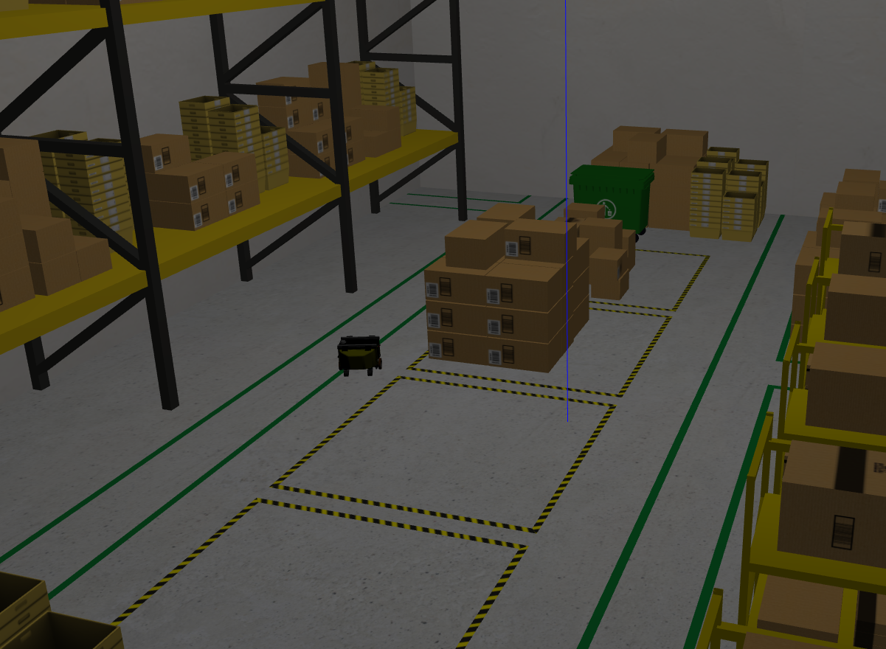
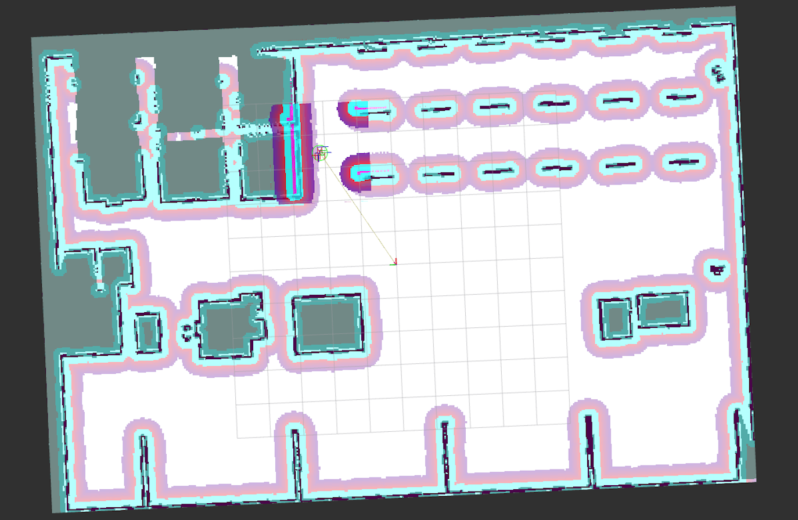
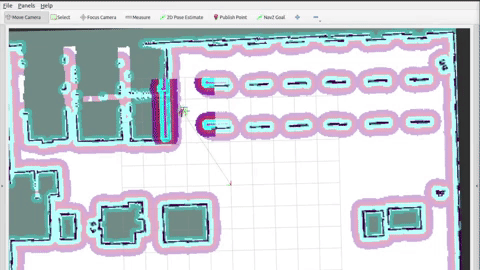

# Advanced Nav2 (Humble)

Nav2 provides features and tools that make building robot navigation applications easier. This note walks through a few “new features” style demos using the Nav2 Simple Commander API in a simulated warehouse environment.

## 1.1 Introduction

In this unit, you review essential Nav2 features, including:

- Basic Nav2 operations through the Simple Commander API
- Using Waypoint Follower / Task Executor plugins via `FollowWaypoints`
- Keepout zones and speed-restricted zones

You then build a basic autonomous demo in a simulated warehouse:



The environment uses the AWS Small Warehouse World and Neobotix’s MP-400 mobile industrial robot.

## 1.2 Setup Nav2

Start by verifying you can navigate in the warehouse world.

### Install and build dependencies

Clone the required Nav2 packages and build your workspace:

```bash
cd ~/ros2_ws/src
git clone -b humble https://bitbucket.org/theconstructcore/nav2_pkgs.git

cd ~/ros2_ws
colcon build
source install/setup.bash
```

Launch the navigation demo:

```bash
ros2 launch path_planner_server navigation.launch.py
```

### Set the initial pose

Set the robot’s initial position using RViz2’s **2D Pose Estimation** tool, or publish an initial pose (in a new terminal):

```bash
ros2 topic pub --once /initialpose geometry_msgs/msg/PoseWithCovarianceStamped \
  "{header: {stamp: {sec: 0}, frame_id: 'map'}, pose: {pose: {position: {x: 3.45, y: 2.15, z: 0.0}, orientation: {z: 1.0, w: 0.0}}}}"
```



You should now see the robot initialized and the costmaps updated in RViz2.

### Send a navigation goal

Use the **Nav2 Goal** button to request the robot to drive to a goal:



If you get into a bad state, close the application and relaunch with the steps above.

## 1.3 The Simple Commander API

Nav2 Simple Commander is a Python API that provides a high-level interface to the Nav2 system, so you can control navigation without directly managing lower-level ROS 2 messages and services.

Key methods used in this note:

- `goToPose()` for navigating to a single pose
- `goThroughPoses()` for navigating through a list of via-poses (no stop at each)
- `followWaypoints()` for navigating through waypoints (often used with stop-at-waypoint behaviors)

## 1.4 Navigate To Pose

`NavigateToPose` is best for point-to-point navigation requests (or tasks represented by a behavior tree with a boundary condition pose, e.g., dynamic object following).

### Action definition

`NavigateToPose.action`

```text
# goal definition
geometry_msgs/PoseStamped pose
string behavior_tree

---

# result definition
std_msgs/Empty result

---

# feedback definition
geometry_msgs/PoseStamped current_pose
builtin_interfaces/Duration navigation_time
builtin_interfaces/Duration estimated_time_remaining
int16 number_of_recoveries
float32 distance_remaining
```

Primary inputs are the target `pose` and optional `behavior_tree`. Feedback includes the robot’s current pose, elapsed time, estimated time remaining, distance remaining, and number of recoveries.

### 1.4.1 Demo

In this demo, the robot drives from its staging point to a shelf (for a human to place an item) and then drives to a pallet jack for shipping.

Create a new package for the unit:

```bash
cd ~/ros2_ws
ros2 pkg create --build-type ament_python nav2_new_features --dependencies rclpy geometry_msgs
```

Inside the package, create a `scripts/` directory and add `navigate_to_pose.py`.

#### `navigate_to_pose.py`

```python
#! /usr/bin/env python3
# Copyright 2021 Samsung Research America
#
# Licensed under the Apache License, Version 2.0 (the "License");
# you may not use this file except in compliance with the License.
# You may obtain a copy of the License at
#
#     http://www.apache.org/licenses/LICENSE-2.0
#
# Unless required by applicable law or agreed to in writing, software
# distributed under the License is distributed on an "AS IS" BASIS,
# WITHOUT WARRANTIES OR CONDITIONS OF ANY KIND, either express or implied.
# See the License for the specific language governing permissions and
# limitations under the License.

import time
from copy import deepcopy

from geometry_msgs.msg import PoseStamped
from rclpy.duration import Duration
import rclpy

from nav2_simple_commander.robot_navigator import BasicNavigator, TaskResult

# Shelf positions for picking
shelf_positions = {
    "shelf_A": [-3.829, -7.604],
    "shelf_B": [-3.791, -3.287],
    "shelf_C": [-3.791, 1.254],
    "shelf_D": [-3.24, 5.861]}

# Shipping destination for picked products
shipping_destinations = {
    "recycling": [-0.205, 7.403],
    "pallet_jack7": [-0.073, -8.497],
    "conveyer_432": [6.217, 2.153],
    "frieght_bay_3": [-6.349, 9.147]}

'''
Basic item picking demo. In this demonstration, the expectation
is that a person is waiting at the item shelf to put the item on the robot
and at the pallet jack to remove it
(probably with a button for 'got item, robot go do next task').
'''


def main():
    # Recieved virtual request for picking item at Shelf A and bringing to
    # worker at the pallet jack 7 for shipping. This request would
    # contain the shelf ID ("shelf_A") and shipping destination ("pallet_jack7")
    ####################
    request_item_location = 'shelf_C'
    request_destination = 'pallet_jack7'
    ####################

    rclpy.init()

    navigator = BasicNavigator()

    # Set your demo's initial pose
    initial_pose = PoseStamped()
    initial_pose.header.frame_id = 'map'
    initial_pose.header.stamp = navigator.get_clock().now().to_msg()
    initial_pose.pose.position.x = 3.45
    initial_pose.pose.position.y = 2.15
    initial_pose.pose.orientation.z = 1.0
    initial_pose.pose.orientation.w = 0.0
    navigator.setInitialPose(initial_pose)

    # Wait for navigation to activate fully
    navigator.waitUntilNav2Active()

    shelf_item_pose = PoseStamped()
    shelf_item_pose.header.frame_id = 'map'
    shelf_item_pose.header.stamp = navigator.get_clock().now().to_msg()
    shelf_item_pose.pose.position.x = shelf_positions[request_item_location][0]
    shelf_item_pose.pose.position.y = shelf_positions[request_item_location][1]
    shelf_item_pose.pose.orientation.z = 1.0
    shelf_item_pose.pose.orientation.w = 0.0
    print('Received request for item picking at ' + request_item_location + '.')
    navigator.goToPose(shelf_item_pose)

    # Do something during your route
    # (e.x. queue up future tasks or detect person for fine-tuned positioning)
    # Print information for workers on the robot's ETA for the demonstration
    i = 0
    while not navigator.isTaskComplete():
        i = i + 1
        feedback = navigator.getFeedback()
        if feedback and i % 5 == 0:
            print('Estimated time of arrival at ' + request_item_location +
                  ' for worker: ' + '{0:.0f}'.format(
                      Duration.from_msg(feedback.estimated_time_remaining).nanoseconds / 1e9)
                  + ' seconds.')

    result = navigator.getResult()
    if result == TaskResult.SUCCEEDED:
        print('Got product from ' + request_item_location +
              '! Bringing product to shipping destination (' + request_destination + ')...')
        shipping_destination = PoseStamped()
        shipping_destination.header.frame_id = 'map'
        shipping_destination.header.stamp = navigator.get_clock().now().to_msg()
        shipping_destination.pose.position.x = shipping_destinations[request_destination][0]
        shipping_destination.pose.position.y = shipping_destinations[request_destination][1]
        shipping_destination.pose.orientation.z = 1.0
        shipping_destination.pose.orientation.w = 0.0
        navigator.goToPose(shipping_destination)

    elif result == TaskResult.CANCELED:
        print('Task at ' + request_item_location +
              ' was canceled. Returning to staging point...')
        initial_pose.header.stamp = navigator.get_clock().now().to_msg()
        navigator.goToPose(initial_pose)

    elif result == TaskResult.FAILED:
        print('Task at ' + request_item_location + ' failed!')
        exit(-1)

    while not navigator.isTaskComplete():
        pass

    exit(0)


if __name__ == '__main__':
    main()

```

> **Note:** Code adapted from the official Nav2 documentation.

Build the workspace:

```bash
cd ~/ros2_ws
colcon build
source install/setup.bash
```

Run the navigation stack (if it isn’t already running):

```bash
ros2 launch path_planner_server navigation.launch.py
```

Run the script:

```bash
python3 ~/ros2_ws/src/nav2_new_features/scripts/navigate_to_pose.py
```

> **Note:** In this demo you don’t need to set the initial pose in RViz2; the Python script sets it. If you moved the robot, you can reset it using RViz2’s **Reset Robot Position** button before launching Nav2 again.

### 1.4.2 Code Review

Focus on where the Simple Commander API is used:

```python
from nav2_simple_commander.robot_navigator import BasicNavigator, TaskResult
```

Import `BasicNavigator` to access the Simple Commander API.

```python
navigator = BasicNavigator()
```

Instantiate the navigator.

```python
navigator.setInitialPose(initial_pose)
```

Set the initial pose (equivalent to RViz2’s **2D Pose Estimate**).

```python
navigator.waitUntilNav2Active()
```

Block until Nav2 is active (lifecycle nodes are in the `active` state).

```python
navigator.goToPose(shelf_item_pose)
```

Request navigation to a single pose.

```python
while not navigator.isTaskComplete():
```

Poll until the navigation action reports completion.

```python
feedback = navigator.getFeedback()
result = navigator.getResult()
```

Read feedback and final result from the action server.

> **Note:** The full API reference is in the Nav2 docs: https://docs.nav2.org/commander_api/index.html

## 1.5 Navigate Through Poses

`NavigateThroughPoses` is best for pose-constrained navigation requests represented by a set of via-poses. This does **not** stop at each pose; it attempts to drive through them as constraints.

### Action definition

`NavigateThroughPoses.action`

```text
# goal definition
geometry_msgs/PoseStamped[] poses
string behavior_tree

---

# result definition
std_msgs/Empty result

---

# feedback definition
geometry_msgs/PoseStamped current_pose
builtin_interfaces/Duration navigation_time
builtin_interfaces/Duration estimated_time_remaining
int16 number_of_recoveries
float32 distance_remaining
int16 number_of_poses_remaining
```

Inputs are similar to `NavigateToPose`, except the goal includes a list of poses. Feedback adds `number_of_poses_remaining` to track progress through the via-points.

### 1.5.1 Demo

In this demo, the robot repeatedly drives a known route through the warehouse. The route can deviate when obstacles are present (e.g., the pallet jack). When it finishes the route, it reverses and runs again until stopped.

Create a new Python script named `navigate_through_poses.py`.

#### `navigate_through_poses.py`

```python
#! /usr/bin/env python3
# Copyright 2021 Samsung Research America
#
# Licensed under the Apache License, Version 2.0 (the "License");
# you may not use this file except in compliance with the License.
# You may obtain a copy of the License at
#
#     http://www.apache.org/licenses/LICENSE-2.0
#
# Unless required by applicable law or agreed to in writing, software
# distributed under the License is distributed on an "AS IS" BASIS,
# WITHOUT WARRANTIES OR CONDITIONS OF ANY KIND, either express or implied.
# See the License for the specific language governing permissions and
# limitations under the License.

import time
from copy import deepcopy

from geometry_msgs.msg import PoseStamped
from rclpy.duration import Duration
import rclpy

from nav2_simple_commander.robot_navigator import BasicNavigator, TaskResult

'''
Basic security route patrol demo. In this demonstration, the expectation
is that there are security cameras mounted on the robots recording or being
watched live by security staff.
'''


def main():
    rclpy.init()

    navigator = BasicNavigator()

    # Security route, probably read in from a file for a real application
    # from either a map or drive and repeat.
    security_route = [
        [1.792, 2.144],
        [1.792, -5.44],
        [1.792, -9.427],
        [-3.665, -9.427],
        [-3.665, -4.303],
        [-3.665, 2.330],
        [-3.665, 9.283]]

    # Set your demo's initial pose
    initial_pose = PoseStamped()
    initial_pose.header.frame_id = 'map'
    initial_pose.header.stamp = navigator.get_clock().now().to_msg()
    initial_pose.pose.position.x = 3.45
    initial_pose.pose.position.y = 2.15
    initial_pose.pose.orientation.z = 1.0
    initial_pose.pose.orientation.w = 0.0
    navigator.setInitialPose(initial_pose)

    # Wait for navigation to activate fully
    navigator.waitUntilNav2Active()

    # Do security route until dead
    while rclpy.ok():
        # Send your route
        route_poses = []
        pose = PoseStamped()
        pose.header.frame_id = 'map'
        pose.header.stamp = navigator.get_clock().now().to_msg()
        pose.pose.orientation.w = 1.0
        for pt in security_route:
            pose.pose.position.x = pt[0]
            pose.pose.position.y = pt[1]
            route_poses.append(deepcopy(pose))
        navigator.goThroughPoses(route_poses)

        # Do something during your route (e.x. AI detection on camera images for anomalies)
        # Print ETA for the demonstration
        i = 0
        while not navigator.isTaskComplete():
            i = i + 1
            feedback = navigator.getFeedback()
            if feedback and i % 5 == 0:
                print('Estimated time to complete current route: ' + '{0:.0f}'.format(
                      Duration.from_msg(feedback.estimated_time_remaining).nanoseconds / 1e9)
                      + ' seconds.')

                # Some failure mode, must stop since the robot is clearly stuck
                if Duration.from_msg(feedback.navigation_time) > Duration(seconds=180.0):
                    print('Navigation has exceeded timeout of 180s, canceling the request.')
                    navigator.cancelTask()

        # If at the end of the route, reverse the route to restart
        security_route.reverse()

        result = navigator.getResult()
        if result == TaskResult.SUCCEEDED:
            print('Route complete! Restarting...')
        elif result == TaskResult.CANCELED:
            print('Security route was canceled, exiting.')
            exit(1)
        elif result == TaskResult.FAILED:
            print('Security route failed! Restarting from the other side...')

    exit(0)


if __name__ == '__main__':
    main()
```

> **Note:** Code adapted from the official Nav2 documentation.

Run the navigation stack:

```bash
ros2 launch path_planner_server navigation.launch.py
```

Run the script:

```bash
python3 ~/ros2_ws/src/nav2_new_features/scripts/navigate_through_poses.py
```

### 1.5.2 Code Review

Key differences from the `NavigateToPose` demo:

Define a set of via-poses:

```python
security_route = [
    [1.792, 2.144],
    [1.792, -5.44],
    [1.792, -9.427],
    [-3.665, -9.427],
    [-3.665, -4.303],
    [-3.665, 2.330],
    [-3.665, 9.283]]
```

Build a `PoseStamped[]` list:

```python
for pt in security_route:
    pose.pose.position.x = pt[0]
    pose.pose.position.y = pt[1]
    route_poses.append(deepcopy(pose))
```

Send the route through `goThroughPoses()`:

```python
navigator.goThroughPoses(route_poses)
```

Add a timeout and cancel if the task runs too long:

```python
if Duration.from_msg(feedback.navigation_time) > Duration(seconds=180.0):
    print('Navigation has exceeded timeout of 180s, canceling the request.')
    navigator.cancelTask()
```
